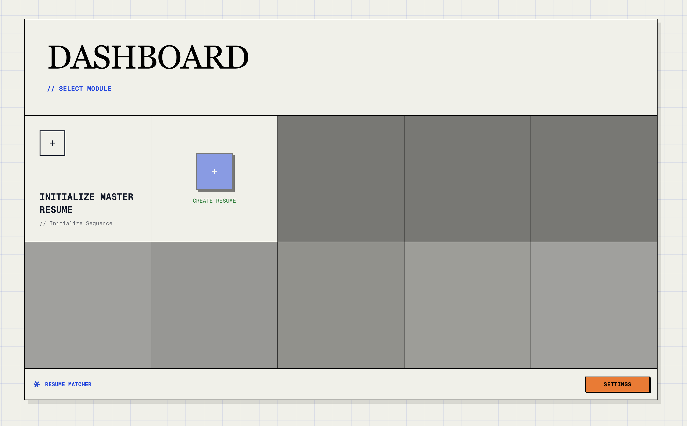
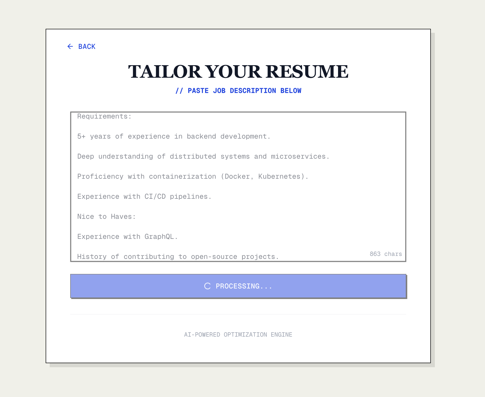
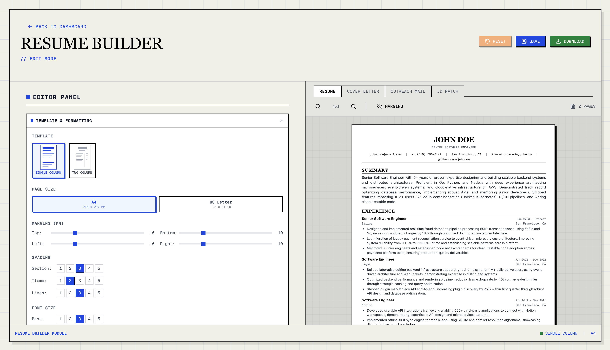

<div align="center">

# Resume Matcher

AI-powered resume tailoring for job applications.


</div>

---

## What is Resume Matcher?

Resume Matcher is a SaaS platform that helps you create tailored resumes for each job application using AI. Simply upload your master resume, paste a job description, and get an AI-generated tailored resume with suggested improvements.

## Features

| Feature | Description |
|---------|-------------|
| **Master Resume** | Upload your main resume once, reuse for all applications |
| **AI Tailoring** | DeepSeek-powered resume customization for each job |
| **Job Matching** | Score how well your resume matches a job description |
| **Cover Letters** | Generate tailored cover letters (Pro only) |
| **PDF Export** | Export resumes in professional PDF templates |
| **Usage Tracking** | Monitor your usage with tier-based limits |


---

## Tech Stack

| Component | Technology |
|-----------|------------|
| Frontend | Next.js 16, React 19, TypeScript, Tailwind CSS |
| Backend | FastAPI, Python 3.11+ |
| Database | PostgreSQL (Supabase) |
| AI | DeepSeek |
| Payments | Stripe |
| PDF Generation | Headless Chromium |

---

## Architecture

```
┌─────────────────┐          ┌─────────────────┐
│     Vercel      │          │    Railway     │
│   (Frontend)    │  <───>   │   (Backend)    │
│    Next.js      │   API    │    FastAPI     │
└─────────────────┘          └─────────────────┘
                                      │
         ┌────────────────────────────┼────────────────────────────┐
         │                            │                            │
    ┌────┴────┐               ┌──────┴──────┐             ┌──────┴──────┐
    │Supabase │               │   Stripe    │             │  DeepSeek   │
    │PostgreSQL│               │  Payments   │             │     AI      │
    └─────────┘               └─────────────┘             └─────────────┘
```

---

## Subscription Plans

| Feature | Free | Pro ($9/mo) | Pro+ ($19/mo) |
|---------|:----:|:-----------:|:-------------:|
| Resume Tailoring / month | 3 | Unlimited | Unlimited |
| Resumes stored | 1 | 5 | Unlimited |
| Cover Letters | ❌ | ✅ | ✅ |
| PDF Export | ✅ | ✅ | ✅ |
| Priority Support | ❌ | ❌ | ✅ |

---

## Quick Start (Production)

### Deployment

Follow the [Deployment Guide](docs/saas-setup/DEPLOYMENT_GUIDE.md) to deploy to production.

### Environment Setup

Required API keys:
- **Supabase**: PostgreSQL database + Auth
- **Stripe**: Payment processing
- **DeepSeek**: AI resume tailoring

See [.env.production.example](apps/backend/.env.production.example) for all required variables.

---

## Documentation

| Document | Description |
|----------|-------------|
| [Deployment Guide](docs/saas-setup/DEPLOYMENT_GUIDE.md) | Step-by-step deployment instructions |
| [Progress Report](docs/saas-setup/WEEK_BY_WEEK_PROGRESS.md) | Development history |
| [Database Schema](docs/saas-setup/supabase-schema.sql) | PostgreSQL schema with RLS policies |

---

## Screenshots

### Step 1: Upload Master Resume



### Step 2: Add Job Description


### Step 3: AI Improvements



### Step 4: Cover Letter


### Step 5: Resume Builder



### PDF Templates

| Template | Preview |
|----------|---------|
| Classic Single Column |  |
| Modern Single Column |  |
| Classic Two Column |  |
| Modern Two Column |  |

---

## License

[](LICENSE)